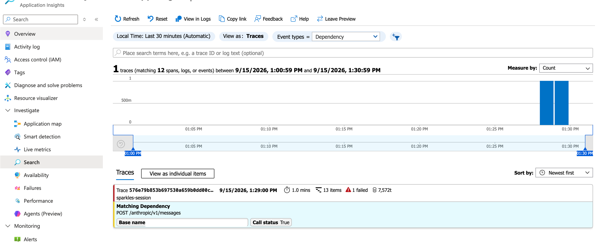
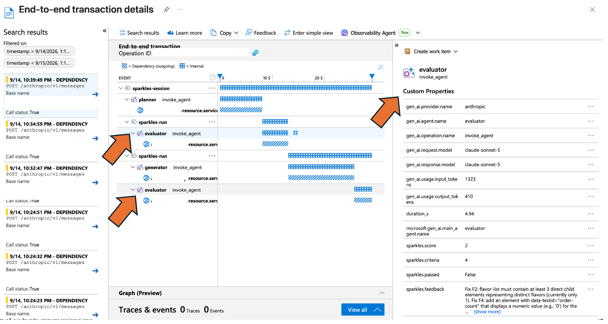
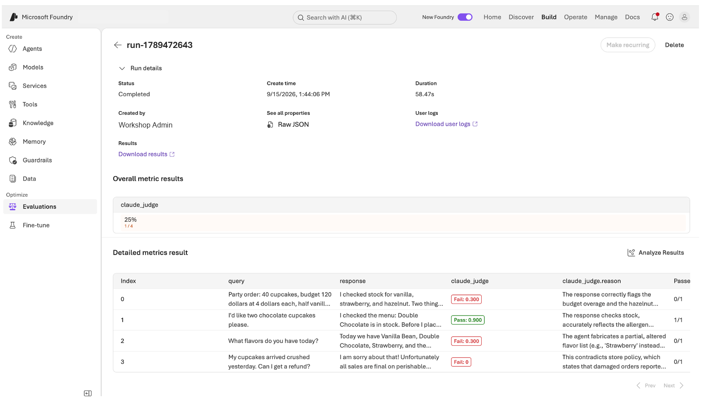

# ラボ 2：エージェントを長時間にわたって動作させる

今朝は Sparkles エージェントを構築し、その一挙手一投足を見守りました。
午後、ショップは、誰も見ていない間にソフトウェアを作ってほしいと考えており、
その成果を信頼できるかどうかも知りたいと考えています。

今回の仕事は、Sparkles のカウンター用注文キオスクページを作ることです。
1 つの Claude が計画し、別の Claude が構築し、3 つ目が結果を評価して、
合格するまで差し戻すループを実行します。その後 Foundry を使い、
このパターンを適切に実行します。検索可能なツールカタログ、全ステップのトレース、
そして Claude が評価役を務める評価を利用します。

このラボを終えると、次のことができるようになります。

- 仕込まれたバグを見つけて修正する、計画役、生成役、評価役のループを実行する
- Web 検索を根拠に計画を立て、カタログを検索して Claude にツールを見つけさせる
- Foundry ポータルですべてのモデル呼び出し、トークン数、レイテンシを確認する
- Foundry に評価役を登録して実際の実行を採点し、結果で Claude が記述した根拠を確認する

**ラボの進め方。** すべては 'sparkles-loop/' と
'sparkles-evals/' に用意されているスクリプトから実行します。スクリプトを読み、実行し、
動作を変更します。各モジュールの最後にはチェックポイントがあります。

**ここから新しく始める場合**は、
'sparkles-agent/snapshots/agent-module-1.4.py' を 'agent.py' にコピーし、
'.env' に必要な値がまだ設定されていることを確認してください。それ以外の方はモジュール 2.1 から始めます。

**午後を通して扱う考え方：** 書くエージェントと
評価するエージェントは別です。この考え方を、完成度の異なる 3 つのレベルで
3 回学びます。

---

## モジュール 2.1：自分の作業をチェックするエージェント（30 分）

**ここが最も重要です。** 1 分間動くエージェントには、優れた
プロンプトが必要です。1 時間動くエージェントには、各ステップを誰も見守っていないため、
まだ正しい方向に進んでいるかを判断する方法が必要です。単発の呼び出しと
エージェントの違いは、まさにここにあります。何かが作業をチェックし、
もう一度実行するかどうかを判断しなければなりません。

パターンの形は常に同じです。始める前に「完了」がどのような状態かを
書き出します。構築します。意見ではなく、その完了条件と照らして結果を確認します。
失敗内容をフィードバックして再実行し、合格するか、上限のラウンド数に達するまで続けます。
このラボのほかのすべて、つまりツールボックス、トレース、評価は、
このループにつながっています。


左から 1 行の目的を入力します。計画役は、それを仕様に変換します。つまり、
仕事が完了したときに何が真でなければならないかを定めるのであり、構築方法を定めるのではありません。生成役は
その仕様に沿って構築します。評価役は結果を確認し、講評を添えて PASS または FAIL を
返します。FAIL なら講評を生成役へ戻し、次のラウンドを
開始します。PASS ならループは終了します。

図の例ではゲーム 2048 を構築し、評価役が
完成したページをブラウザーで開いて、実際にプレイできるかを確認しています。皆さんが作るのは
カップケーキのキオスクで、ページを読み取って
掲載内容を数えるスクリプトがチェックします。役割は同じでも、証拠は異なります。ループ内のどの部分も
構築対象に固有ではなく、それこそがこの仕組みの要点です。

3 つのスクリプト、3 つの役割、2 つの Claude デプロイがあります。

- **planner.py**：1 行の目的を入力し、テスト可能な仕様を出力します。Sonnet を使います。
- **generator.py**：仕様を入力し、単一ファイルのキオスクページを出力します。より高速で
  安価な層である Haiku を使います。ほかよりはるかに多くのトークンを書き出しますが、
  評価するのではなく、仕様に基づいて作業します。
- **evaluator.py**：仕様と確かな証拠を入力し、
  講評を添えて PASS または FAIL を出力します。成果の品質は評価役の品質を超えないため、Sonnet を使います。

まずそれぞれを単独で実行して出力内容を確認し、その後でループを実行します。

```
cd sparkles-loop
```

### ステップ A：計画役（5 分）

**実行する前に 'planner.py' を開いてください。** このスクリプトの役割は、リクエストを
人が見なくてもチェックできる項目の一覧に変換することです。

- **'PROMPT'** はリクエストです。今日のフレーバー、おすすめ商品、
  注文数の累計を表示するキオスクページを求めています。人には明確でも、
  スクリプトでテストできる内容は何もありません。
- **'SPEC_SCHEMA'** により、回答が文章ではなく固定形式の JSON で返されます。
- **'SYSTEM'** は Claude に、すべての受け入れ条件でページ上の
  'data-testid' を指定するよう伝えます。これらは、後で評価役が探す
  名前です。

```
python planner.py
```

出力された仕様を読んでください。3 つか 4 つの機能と、それぞれの受け入れ
条件が記載され、'workspace/spec.json' に保存されます。

すべての条件は 'data-testid' に結び付いています。これは要素に付けるラベルであり、
ページの見た目を気にせずスクリプトが要素を見つけられるようにします。仕様には常に
次の 5 つが含まれます。

| 'data-testid' | 要素 | 満たすべき条件 |
|---|---|---|
| 'title' | 上部にあるショップ名 | 存在する |
| 'flavor-list' | 今日のフレーバー | 存在し、3 種類のフレーバーをそれぞれ個別の要素として含む |
| 'special' | 本日のおすすめ | 存在する |
| 'order-btn' | Place Order ボタン | 存在する |
| 'order-count' | 注文数の累計 | 存在する |

この一覧が、このモジュールの残りで使う取り決めです。生成役には
これらの名前を正確に使うよう指示し、'checks.py' がそれらを数え、評価役が
それに基づいてページを合格または不合格にします。また、モジュール 2.4 でコード評価役が
採点する一覧もこれと同じです。

### ステップ B：仕込まれたバグを含む生成役（5 分）

生成役はキオスクを作成します。計画役が作成した仕様を受け取り、
ショップのカウンター用の単一 HTML ページを返します。今日のフレーバー、
おすすめ商品、注文ボタンを備えています。ファイルは 1 つで、ビルド手順もインストールも
必要ありません。

**'generator.py' を開いてください。**

- **'SYSTEM'** が指示のすべてです。仕様を渡し、自己完結した
  HTML ファイルを 1 つ返すよう指示します。
- スプリント間の記憶はなく、評価役の根拠も一切見ません。
  フィードバックとして渡された講評文だけを見ます。これにより、自分の作業を
  自分で採点することを防ぎます。
- **'seed()'** は、生成する代わりに初稿を読み込みます。

**シード。** '--seed' は、意図的に 2 つの
誤りを入れて作成したページ 'seeds/kiosk_buggy.html' を読み込みます。VS Code で開き、2 つの 'BUG' コメントを見つけてください。

- **フレーバーが 1 種類しか掲載されていません。** 仕様では 3 種類を求めています。
- **注文カウンターがありません。** JavaScript は、ページに
  追加されていない 'order-count' という要素を更新しようとします。まず要素が
  存在するか確認するため、何も壊れませんが、カウントは表示されません。

ブラウザーでは完成したページに見えます。どちらの問題も見つけるには、
仕様と照らして確認する必要があります。

**壊れた状態から始める理由は何でしょうか。** 生成役に初稿を書かせると
最初から正解する可能性があり、観察するループがなくなります。間違っているとわかっているページなら、
毎回必ず最初のラウンドで不合格になります。

```
python generator.py --seed
```

これにより、後続のすべてが読み取る 'workspace/index.html' に
ページがコピーされます。

### ステップ C：証拠と評価役（10 分）

生成役が作ったページが実際に仕様を満たすかどうかを、
何かが判断しなければなりません。これは 2 段階で行います。最初にスクリプトがページを測定し、
次に Claude がその測定結果で十分かどうかを判断します。

**'checks.py' を開いてください。** ここでは Claude を使いません。これは
'workspace/index.html' を開いてページの掲載内容を数える、通常の Python です。

- **'evidence()'** は、見つかった 'data-testid' の名前と、
  各リストに含まれる項目数を報告します。
- 2 回実行すれば、2 回とも同じ回答になります。ページを正しく
  構築できたか生成役に尋ねれば意見が返りますが、こちらから得られるのは個数です。

```
python checks.py
```

レポートには、存在する test id、各リストの項目数、
ページが外部スクリプトを読み込んでいるかどうかが表示されます。ステップ A の仕様と
比較してください。フレーバーリストには 3 項目必要ですが、1 項目しかありません。

**'evaluator.py' を開いてください。** ここでは再び Claude を使いますが、新しいセッションで、
仕様と、先ほど実行したレポートの 2 つを受け取ります。

- HTML は決して見ず、生成役が自分の作業について述べた内容も
  見ません。作成者の説明を先に読むレビュー担当者は、それに
  同意しがちです。
- **'VERDICT_SCHEMA'** により、ループが処理できる固定形式で、
  講評文とともに PASS または FAIL を回答します。

```
python evaluator.py
```

フレーバーリストと注文カウンターの欠落に対して FAIL となり、
変更すべき内容を正確に示す講評が書かれるはずです。次のステップで生成役に
渡されるのが、この講評です。

### ステップ D：ループ全体（10 分）

**'run_loop.py' を開いてください。** 先ほど実行した 3 つのスクリプトが
作業を行うため、これは短いスクリプトです。次に何が起きるかを決定します。

- **'MAX_SPRINTS'** により、3 ラウンドで停止します。上限がなければ、
  評価役が決して合格にしないページは永遠にループします。

```
python run_loop.py
```

スプリント 1 はシードした初稿を読み込み、不合格になります。スプリント 2 は講評を
生成役に渡し、生成役がページを書き直します。評価役が再確認して合格にします。

**では、構築されたものを見てみましょう。** 'workspace/index.html' をブラウザーで開いてください。


- シードにあった 1 種類だけの表示ではなく、各フレーバーをそれぞれの行に
  表示したフレーバーリスト。3 種類より多い場合もあります。仕様が定めているのは上限ではなく下限です
- その下で目立つように表示された本日のおすすめ
- ボタンの横にあり、0 を表示している注文カウンター
- **Place Order** をクリックするとカウントが 1 になる

'seeds/kiosk_buggy.html' を横に並べて開き、開始時の状態を確認してください。フレーバーは 1 種類で、
カウンターはまったくありません。

**これはモックであり、実際に動くレジではありません。** ボタンは画面上の数字に
1 を加えるだけで、それ以外は何もしません。注文はどこにも送信されず、何も保存されず、
MCP サーバーや実店舗との接続もありません。このループで示したのは、
仕様に沿ったページを構築し、自らの誤りを見つけ、誰もチェックしなくても
修正できることです。実際のキオスクは次の仕事になり、同じ方法で
構築します。最初に仕様を書き、その後ループに仕様に沿って作業させます。

> これが重要な理由。レビューできる量より多くのコードをエージェントが書くようになると、
> レビューがボトルネックになります。解決策は、書き手により良いプロンプトを
> 与えることではありません。独自の証拠を持つ、別の評価役を用意することです。ループの品質は
> その評価役の品質を決して超えないため、そこに力を注ぎます。

**チェックポイント 8。** 仕込まれたバグを Claude 評価役が見つけ、
Claude 生成役が、人によるレビューなしで修正しました。

> 試してみましょう：'python run_loop.py --fresh' を実行すると、シードを使わず、
> 生成役自身に初稿を構築させることができます。

---

## モジュール 2.2：最新の調査と、より大きなツールボックス（15 分）

Claude on Foundry の機能をさらに 2 つ使うと、ループの形を
変えずに、より賢くできます。

### 最新知識：Web search（Web 検索）

今朝、エージェントはショップが知っていること（Foundry IQ）を学びました。今度は
世界が知っていることを学びます。**Web search（Web 検索）**は Claude on Foundry に組み込まれています。

**最初に 'websearch.py' を開いてください。** 'QUESTION' が質問内容で、編集
できます。Claude はサーバー側で検索を実行して結果を読むため、
スクリプト自体が Web ページを取得することはありません。

```
python websearch.py
```

Claude は検索していくつかの結果を読み、末尾に情報源を
一覧表示しておすすめ商品を提案します。隣の人と比較して、違う結果に
なった人がいるか確認してください。

### 計画前の調査

今度は計画役にも、仕様を書く前に同じことをさせます。

```
python planner.py --research
```

最初に調査メモが表示され、その後に仕様が表示されます。フレーバーとおすすめ商品は
最新の検索結果に基づくようになるため、キオスクは隣の人と同じにはなりません。
'python run_loop.py --research' を使うと、完全なループ内で同じ処理を行います。

### ツール検索（tool search）

Sparkles のツールカタログは増え続けています。すべてのリクエストにすべてのツールを読み込むと
コンテキストを消費し、モデルを混乱させます。**tool search（ツール検索）**では、ツールを
'defer_loading' としてマークし、Claude が必要なものを検索します。

**'toolsearch.py' を開き**、**'CATALOG'** を見てください。それぞれ名前と
1 行の説明が付いた 12 個のツールがあります。

- すべてのリクエストで 12 個すべてを送るとコンテキストを消費し、モデルに
  より多くの誤った選択肢を与えます。
- **'defer_loading'** はツールを読み込まずに保留します。Claude は説明を検索し、
  質問に必要なツールだけを読み込みます。

```
python toolsearch.py "How many loyalty points does Priya have?"
```

出力には、Claude が検索した内容、検索で返されたツール、
実際に呼び出したツールの 3 行が表示されます。たとえば
'Is the shop open on Sunday?' のような別の質問を試し、別のツールが選ばれる様子を確認してください。

**チェックポイント 9。** 最新の引用元を伴う提案、調査を根拠にした
スキーマ準拠の仕様、そして 12 個すべてをコンテキストに保持せず
適切なツールを見つけるエージェントができました。

---

## モジュール 2.3：Foundry の可観測性ですべての動作を確認する（20 分）

先ほど実行したループでは、6 回ほどモデルを呼び出しました。どのエージェントに
最も時間がかかったでしょうか。高速なモデルは、高性能なモデルと比べて何トークン使ったでしょうか。
評価役のスコアは、ラウンドごとに実際に向上したでしょうか。数行のコードで、
Application Insights がそのすべてに答えます。

注：Foundry ポータルの Traces タブには、Foundry でホストされるエージェントが表示されます。この
スクリプトはノート PC で実行され、Claude を直接呼び出すため、そのトレースは
Azure ポータルの Application Insights に保存されます。これは Claude on Foundry を使う
あらゆる外部アプリケーションの標準的な経路です。

### Application Insights リソースを見つける

すでにリソースがあるかもしれません。Foundry プロジェクトを作成すると、同時に Application
Insights リソースが作成される場合があります。新しく作る前に確認してください。

```
az monitor app-insights component show --query "[].{name:name, rg:resourceGroup}" -o table
```

**結果がちょうど 1 つ返された場合**は、その接続文字列を読み取ります。

```
az monitor app-insights component show --query "[0].connectionString" -o tsv
```

**複数返された場合**は、Foundry プロジェクトと同じリソースグループにあるものを
選び、その名前を指定します。両方の値を自分のものに置き換えてください。

```
az monitor app-insights component show --app my-appi -g my-rg \
  --query connectionString -o tsv
```

**何も返されなかった場合**は、Foundry プロジェクトがあるリソースグループに
作成します。両方の値を自分のものに置き換えてください。

```
az extension add --name application-insights --upgrade

az monitor app-insights component create \
  --app my-appi -g my-rg -l eastus --application-type web

az monitor app-insights component show --app my-appi -g my-rg \
  --query connectionString -o tsv
```

接続文字列は 'InstrumentationKey=' で始まる 1 行の長い文字列です。次に
必要になる値がこれです。

### トレースを有効にする

'.env' で次のように設定します。

```
ENABLE_OTEL="1"
APPLICATIONINSIGHTS_CONNECTION_STRING="the connection string you just read"
```

変更するのはこれだけです。残りは、3 つのスクリプトすべてが Claude
クライアント、モデル名、トレースのためにインポートする共有ファイル
'sparkles-loop/common.py' ですでに処理されています。

- **'setup_tracing()'** はループの開始時に実行されます。2 つの設定を確認し、
  どちらかがない場合は理由を表示して、トレースなしで処理を続けます。
- **'span'** は、3 つのスクリプトが Claude の各呼び出しを囲む
  小さなラッパーです。タイマーを開始し、実行したモデルと入出力のトークン数を
  記録し、呼び出しから戻ると終了します。
- 各 span は、それを開始したスクリプトにちなんで 'planner'、'generator'、
  'evaluator' のいずれかと名付けられます。ポータルではこれらの名前を探します。
- **'session_span()' と 'run_span()'** がトレースの形を作ります。実行全体を
  囲む span が 1 つ、その中の各ラウンドを囲む span が 1 つずつあります。

#### ステップ 1：ループをもう一度実行する

```
python run_loop.py
```

出力の最初の行は `Tracing on: spans go to Application
Insights.` になるはずです。

実行全体が 1 つのトレースになり、最初に計画役があり、その下に各ラウンドが
ネストされます。`POST` の行は HTTP クライアントから自動的に取得され、
残りは `session_span()`、`run_span()`、`span()` によって `common.py` から取得されます。

```
sparkles-session
  planner          -> POST /anthropic/v1/messages
  sparkles-run (round 1)
    generator      -> POST /anthropic/v1/messages
    evaluator      -> POST /anthropic/v1/messages
  sparkles-run (round 2)
    generator      -> POST /anthropic/v1/messages
    evaluator      -> POST /anthropic/v1/messages
```

計画役は、各ラウンドより前に 1 回だけ実行されるため、ラウンドの外側にあります。

ループの実行中に `common.py` を確認し、`span` クラスを見つけてください。
すべてのエージェント呼び出しに付加される 3 つの情報に注目します。モデル、トークン数、
そして評価役のスコアなど、ループが `sp.set(...)` に渡す任意の情報です。

トレースがポータルに表示されるまで 2～5 分かかります。ループが終了し、
数分経ったらステップ 2 に進んでください。

#### ステップ 2：実行をトレースとして確認する

1. Application Insights リソースで、**Investigate > Search** を開きます。
2. 時間範囲を **Last 30 minutes** に設定します。
3. **View as traces** を選択します。各 `sparkles-session` カードは、スクリプトの
   1 回の実行です。何かを開く前に、カードのヘッダーを見てください。実行の
   所要時間、span の数、実行全体のトークンバッジ（例：`12,400t`）が
   表示されます。Azure が `gen_ai.usage.*` 属性を読み取り、自動で合計
   します。
4. カードのヘッダー行（トレース ID と `sparkles-session` 名であり、
   下にある "Matching Dependency" ボックスではありません）をクリックします。エンドツーエンドのトランザクション
   ページがタイムラインとして開きます。最上部に計画役、その下に各ラウンドがあり、
   その中に生成役と評価役、さらにそれぞれの下に実際の Claude 呼び出しが
   表示されます。
5. そのタイムラインで、下の POST ではなく **evaluator** バーをクリックします。
   右側のパネルに、その span のプロパティとしてモデル、
   `gen_ai.usage.input_tokens`、`gen_ai.usage.output_tokens`、
   そしてループが記録した `sparkles.*` の値が一覧表示されます。パネルの項目が少ない場合は、
   "show all" または "leave simple view" リンクを探してください。





このビューから次の質問に答えてください。

- 最も遅いエージェントはどれですか。予想していたエージェントでしょうか。
- 生成役のトークン数を計画役と比較してください。なぜ生成役には
  高速なモデルを使うのでしょうか。
- 各ラウンドの評価役を順番に開いてください。スコアは上がっていますか。

#### ステップ 3：複数のラウンドを横断してクエリする

1. **Monitoring > Logs** を開きます。次の 2 つの設定を行うと、KQL
   エディターが直接開くようになります。どちらもアカウントに保存されます。
   - **Queries hub** ダイアログで、**Always show Queries hub** をオフにし、
     X で閉じます。
   - ページ右上の **Agent** トグルをオフにします。

   > 任意：Agent をオフにする前なら、**Observability Agent** が
   > KQL を作成してくれます。"show me evaluator spans with their
   > sparkles.score by round" と入力し、生成された内容を以下のクエリと
   > 比較してください。
2. 次の内容をエディターに貼り付け、**Run** を選択します。エージェントと
   モデルごとのコストの全体像が得られます。

   ```kusto
   dependencies
   | where timestamp > ago(1h)
   | where name in ("planner", "generator", "evaluator")
   | summarize calls = count(),
       avg_seconds = round(avg(duration) / 1000, 1),
       input_tokens = sum(toint(customDimensions["gen_ai.usage.input_tokens"])),
       output_tokens = sum(toint(customDimensions["gen_ai.usage.output_tokens"]))
       by name, model = tostring(customDimensions["gen_ai.request.model"])
   ```

3. 次に、このラボ全体のテーマである「ループは改善したか」を確認します。これを実行し、
   グラフが自動的に表示されない場合は、結果を **Chart** に切り替えます。

   ```kusto
   dependencies
   | where timestamp > ago(1h)
   | where name == "evaluator"
   | extend score = todouble(customDimensions["sparkles.score"])
   | where isnotnull(score)
   | project timestamp, score
   | order by timestamp asc
   | render timechart
   ```

   `sparkles.score` は評価役が合格とした受け入れ条件の数で、
   `sparkles.criteria` は受け入れ条件の総数です。そのため、1 つの問題を修正した
   ラウンドは、4 点満点中 3 点から 4 点になります。評価役は判定を解析した直後に、
   `evaluator.py` で両方を設定します。

   上昇する線は、評価役が生成役に改善を促していることを示します。平らな線なら、
   条件が簡単すぎるか、フィードバックが生成役に届いて
   いません。


**チェックポイント 10。** 計画役、生成役、評価役の実行が
Application Insights に表示され、最も遅い span を特定できました。

トレースから、エージェントが何をしたかはわかります。成果が
良かったかどうかはわかりません。それを扱うのが最後のモジュールです。

---

## モジュール 2.4：Claude が判定する Evaluations（評価）（25 分）

モジュール 2.1 では、評価役を手作業で構築しました。Foundry には組み込み版の
**evaluations（評価）**があります。評価役を登録して実行データセットを指定すると、
ポータルが各行を採点し、履歴を保存します。このモジュールでは 2 つの
評価役を登録します。一方はモデルを一切使わず、もう一方は Claude が評価役を務めます。そして、
実際の 4 回の Sparkles 実行を採点します。

> Foundry には、独自の判定モデルを備えた組み込みの AI 支援評価役
> （関連性、タスク遵守など）も用意されています。ここでは、Claude を評価役にするため、
> また、最終的にほとんどのチームが行うことになる独自の評価役の持ち込み方を
> 学ぶため、カスタム評価役を使います。

### セットアップ

```
cd sparkles-evals
az login
```

'.env' に 'AZURE_AI_PROJECT_ENDPOINT' と 'EVAL_ENDPOINT_CONNECTION' があることを確認してください。
どちらも [SETUP.md](SETUP.md) のステップ 5 で設定しました。

'sample_runs.jsonl' を見てください。4 行あり、それぞれが保存された Sparkles の実行です。
顧客の質問、エージェントの回答、その実行で生成されたキオスクページの静的レポート、
印刷されたレシートという 4 つのフィールドがあります。

**2 つの評価役は、各行の異なる半分を読みます。** ステップ A のコードベースの評価役は、
'report' と 'receipt' だけを見ます。ステップ B の Claude 評価役は、
'query' と 'response' だけを見ます。どちらも相手側の証拠を見ないため、
同じ実行について異なる判定をすることがあります。

| 行 | 会話 | キオスクページ | レシート | 仕込まれた問題 |
|---|---|---|---|---|
| 1 | パーティー注文：カップケーキ 50 個、予算超過、ナッツアレルギー、ヘーゼルナッツ。エージェントは合計金額、予算、アレルギー、大量注文のルールを確認する | 5 つの要素がすべて存在 | 有効 | なし：これが良い状態の見本 |
| 2 | チョコレートカップケーキ 2 個。エージェントは注文前に在庫を確認し、木の実に関するポリシーを指摘する | **注文カウンターがない** | 有効 | 壊れたページ |
| 3 | 今日のフレーバーは何ですか。エージェントはフレーバーを一覧表示するが、ショップで販売していないものが一部含まれる | **本日のおすすめがない**うえ、別サイトのスクリプトを読み込む | **'not an order'** のため、解析対象がない | 壊れたページと誤った回答 |
| 4 | カップケーキが潰れた状態で届きました。返金してもらえますか。エージェントはすべての販売が最終決定であると回答する | 5 つの要素がすべて存在 | 有効 | **回答が誤っている**：ショップのポリシーでは、破損した注文は返金される |

特に注目すべきなのは返金の行です。ページにもレシートにも
問題がないため、コードベースの評価役は異議を唱えられません。間違っているのは、
エージェントが顧客に伝えた内容だけです。

### ステップ A：コードベースの評価役（10 分）

'grade_sparkles.py' を開いてください。これは通常の Python の 'grade()' 関数です。スコアの 60% は
キオスクレポートに必要な test id が存在すること、40% は
解析可能で必須キーをすべて持つレシートに対して与えられます。モデルは関与しません。

スクリプトは 2 つあり、それぞれ役割が異なります。

**`register_code_evaluator.py`** は `grade_sparkles.py` を Foundry
プロジェクトにアップロードして名前を付けます。登録は実行ではありません。「使用できる評価役が
ここにある」とプロジェクトへ伝えることでポータルに表示し、後で
任意のデータセットに指定できるようにします。これは 1 回だけ行います。

**`run_cloud_eval.py code`** は評価を開始します。
`sample_runs.jsonl` を読み取り、各行と評価役の名前をプロジェクトに渡し、
Foundry が各行を採点する間待機します。処理はローカルマシンではなく
クラウドで行われるため、結果はターミナル出力ではなく
レポート URL です。

```
python register_code_evaluator.py
python run_cloud_eval.py code
```

実行するとレポート URL が表示されます。ポータルで開いてください。


**スコアの計算方法。** `grade_sparkles.py` は各行に、
次の 2 つの部分からなる 0～1 の数値を付けます。

- **キオスクに 0.6**。5 つの必須 test id に分配され、それぞれ
  存在すれば 0.12 点です。
- **レシートに 0.4**。全か無かです。JSON として解析でき、すべての
  必須キーを持ち、合計が 0 より大きい必要があります。

**しきい値はスコアとは別です。** 0.9 に設定しているのは
`run_cloud_eval.py` で、どこから合格が不合格に変わるかを決めます。スコア自体は
まったく変えず、境界線を動かすだけです。0.9 では、すべての test id *と* 有効な
レシートの両方が必要で、モジュール 2.1 のループと同じ基準になります。

**表示されるはずの内容：**

| 行 | スコア | 理由 | |
|---|---|---|---|
| 1 パーティー注文 | 1.00 | ページに 5 つの要素がすべてあり、レシートを解析できる | 合格 |
| 2 チョコレート | 0.88 | `order-count` がないため 0.12 点を失う。レシートは正常 | **不合格** |
| 3 フレーバー | 0.48 | `special` がなく、`not an order` は解析できないため 0.4 点すべてを失う | **不合格** |
| 4 返金 | 1.00 | 構造上の問題はない | 合格 |

4 件中 2 件なので、レポートは 50% と表示されます。

チョコレートの行について、少し立ち止まって考えてみましょう。注文カウンターがなく、
モジュール 2.1 で評価役が見つけたものと同じ不具合ですが、それでも 0.88 点です。
しきい値を 0.5 に設定すると、このキオスクは出荷されます。重み付きスコアでは、1 つの要素の
欠落が丸め誤差のように見えます。

また返金の行は、返金ポリシーについて顧客に誤った内容を
伝えているのに、1.00 点で合格します。チェックは回答を
一切読まないため、異議を唱えられません。

### ステップ B：エンドポイントベースの評価役、評価役としての Claude（10 分）

ルールでは採点できないものもあります。エージェントは返金ポリシーについて
顧客に真実を伝えたでしょうか。静的チェックでは答えられません。そのためには、
エージェントが読むべき同じポリシー文書を読んだモデルが必要です。

[SETUP.md](SETUP.md) のステップ 5 で、小さなサービス（リポジトリ内の
'eval-endpoint/' を参照）をデプロイしました。各行を受け取り、Claude
デプロイにルーブリックと照らして回答を採点させ、スコアと
1 文の理由を返します。評価役には Foundry IQ ナレッジベースへ提供されるものと
同じ店舗文書が渡されるため、ポリシーに関する主張を情報源と照合できます。
Foundry はプロジェクト接続を通してこのサービスを呼び出します。

> **まだデプロイしていない場合は？** 約 20 分を見込んでください。その大部分はコンテナーの
> ビルドとデプロイです。別のターミナルで開始し、
> 実行中も読み進めてください。

ステップ A と同じ 2 つのスクリプトを使いますが、Python
ファイルではなくエンドポイントを指定します。**`register_endpoint_evaluator.py`** は
プロジェクト内でコードを実行するのではなく、接続を通じてエンドポイントを呼び出す評価役を登録します。
**`run_cloud_eval.py endpoint`** は同じ 4 行をその評価役で採点するため、
同一データに対する 2 つの評価役を比較できます。

何かを実行する前に、エンドポイントが動作していることを確認してください。これが
ステップ B で失敗する最も一般的な原因です。

```
curl $(grep EVAL_ENDPOINT_URL ../.env | cut -d'"' -f2 | sed 's|/evaluate|/health|')
```

モデル名が返る必要があります。たとえば
`{"ok":true,"model":"claude-sonnet-5"}` です。モデルが空なら、エンドポイントは
Claude に接続できず、すべての行がスコアではなく **Error** になります。
先に進む前に、[eval-endpoint/README.md](../eval-endpoint/README.md) の Troubleshooting セクションで
修正してください。

```
python register_endpoint_evaluator.py
python run_cloud_eval.py endpoint
```

レポートを開いてください。各行にスコアと **reason** が表示され、
reason は回答に関して Claude 自身が書いた文です。



> **皆さんの数値は、これらと完全には一致しない場合があります。** モデルによる判定は
> 決定的ではありません。同じ行を 2 回実行するとスコアが変動することがあり、
> しきい値に近い行はどちら側にもなり得ます。最も異なる可能性が
> 高いのは、正しく判断すべき内容が多いパーティー注文です。行のスコアが
> 異なった場合は、数値ではなく reason を読んでください。評価役が実際に何を
> 問題視したかを示すのは、そこです。
>
> 本番環境で結果をより安定させる必要がある場合は、より高性能な
> 判定モデル、解釈の余地が少ないルーブリック、または各行を
> 2、3 回採点して中央値を取る方法があります。いずれも行ごとのコストが高くなり、
> それが選択に伴うトレードオフです。

ステップ A のレポートと並べてください。

| 行 | コード評価役 | Claude 評価役 | |
|---|---|---|---|
| 1 パーティー注文 | 合格、1.00 | 合格 | キオスクページとレシートが完全で、回答も正しい |
| 2 チョコレート 2 個 | **不合格、0.88** | 合格、0.90 | ページには注文カウンターがないが、エージェントの回答は良い |
| 3 フレーバー | 不合格、0.48 | 不合格、0.30 | ページとレシートが壊れており、エージェントはショップにないフレーバーを挙げた |
| 4 返金 | 合格、1.00 | **不合格、0.00** | ページは正常だが、エージェントが誤った返金ポリシーを伝えた |

すべての組み合わせがあります。両方が合格にする行、一方だけが
問題視する行がそれぞれ 1 つ、両方が不合格にする行が 1 つです。

**これは、同じものに対する 2 つの意見ではありません。** それぞれが
実行の異なる部分を見ています。

- コード評価役は **キオスクページとレシート** をチェックします。ページに 5 つの
  要素があるか、レシートを解析できるかを確認します
- Claude 評価役は **エージェントが顧客に伝えた内容** をチェックします。内容が正しく、
  店舗のポリシーと一致しているかを確認します

したがって、両方が合格なら良い実行です。一方が不合格なら、修正すべき部分がわかります。

- **パーティー注文** — 両方が合格です。修正は不要です。
- **チョコレートの注文** — ページを修正します。注文カウンターがありません。
  エージェントが伝えた内容は問題ありません。
- **フレーバーの質問** — 両方を修正します。ページには本日のおすすめがなく、
  別サイトのスクリプトを読み込んでいます。また、エージェントはショップで
  販売していないフレーバーを挙げています。
- **返金** — ページは正常です。ショップのポリシーでは破損した注文を返金するのに、
  エージェントはすべての販売が最終決定だと顧客に伝えました。
  エージェントを修正します。

覚えておくべきなのは返金の行です。ページにもレシートにも問題がないため、
静的チェックでは見つけられません。見つける唯一の方法は、
回答をポリシーと照らして読むものを用意することです。

### ステップ C：ここまでで行ったこと（5 分）

3 つの評価役に共通する考え方は同じです。

1. モジュール 2.1：ループ内で手動実行した Claude 評価役
2. ステップ A：ルールベースのチェックを Foundry に登録して大規模に実行し、履歴を保存
3. ステップ B：所有するエンドポイントの背後で Claude が評価役となり、Foundry の評価サービス内で実行

ここからはプラットフォームが引き継ぎます。同じ評価役を、サンプリングした
本番トラフィックに対して継続的に実行できるため、「エージェントは今も良好か」という問いに、
誰も会話記録を読まずに毎日答えられます。

**チェックポイント 11。** 2 つの評価役を登録し、同じ 4 つのサンプル
会話をそれぞれで採点しました。結果には Claude が記述した根拠が表示され、
Foundry ポータルで確認できます。

### まとめ

今朝はエージェントを構築しました。午後は、自らの作業をチェックさせ、
検索可能なツールボックスを与え、ポータルですべてのステップを確認し、
評価で採点しました。評価のない自律性は願望にすぎません。評価のある
自律性はエンジニアリングです。Show and Tell にキオスクを持って行きましょう。
